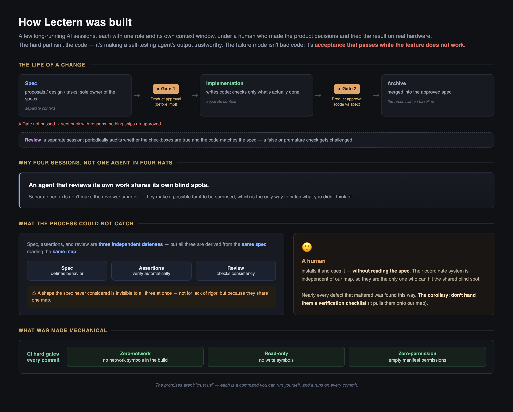

*English · [中文](HOW_THIS_WAS_BUILT.zh-CN.md)*

# How this was built

Lectern was written by AI agents. Nearly all of the code, the specifications,
the acceptance tests and this file were produced by Claude, working in several
long-running sessions with different roles, under a human who made the product
decisions and tried the result on real hardware.

That is not the interesting part — plenty of software is written that way now.
The interesting part is what it took to make the output trustworthy, because
the failure mode of an agent writing its own tests is not bad code. It is
**acceptance that passes while the feature does not work.**

This document is the account of that, including the parts that went wrong. It
is not a methodology being sold; it is a log.

<!-- This diagram summarizes the mechanisms described below. It is a second copy
     of those claims and no script can check it — if the gates, the roles, or the
     CI checks change, regenerate it or delete it. -->

## The shape of it

Four roles, each a separate session with its own context window:

- **Product** — positioning, what the thing is for, and two approval gates: one
  before implementation starts, one before a completed change is archived.
- **Specification** — owns the spec artifacts and the scope of each change.
  Implementation does not edit specs; when the code and the spec disagree, the
  disagreement is escalated rather than silently resolved.
- **Implementation** — writes the code, and marks task checkboxes only for work
  that is actually done.
- **Review** — periodically audits whether the checkboxes are true and whether
  the code matches the spec.

Specifications live in [`openspec/`](openspec/): `specs/` is approved behavior,
`changes/` holds in-flight proposals with their design notes, delta specs and
task lists. Everything in this repository was built through that loop, and the
archived changes are still there to read. They are left as they were written —
internal working vocabulary and all — because editing a record after the fact
turns it into a fabricated one, and the point of keeping them is that they are
the real thing.

The reason the roles are separate sessions rather than one agent wearing four
hats is narrow and practical: **an agent that reviews its own work shares its
own blind spots.** Separate contexts do not make the reviewer smarter, but they
do make it possible for the reviewer to be surprised.

## What went wrong

**Assertions that were narrower than the requirement.** A spec scenario read
"shows a heading outline, and clicking an entry scrolls to it." The test
asserted the first clause and passed. Clicking did nothing in the rich-text
Markdown view for weeks, and every automated check was green the entire time.
The general form: a test proves a thing exists, rarely that the *rest of the
sentence* holds. The habit that came out of it is to take each clause of a
requirement separately and ask which assertion covers *that clause*.

**Numbers that measured the wrong thing.** Icon colors were checked with a
pairwise hue-distance metric. The metric said the dark theme was no worse than
the light one; it looked visibly worse. The metric was not miscomputed — the
problem was not *between* any pair. One color sat between two groups and welded
them together, and a pairwise metric can never see a member that belongs to no
pair. When a number and a careful observation disagree, the first hypothesis to
rule out is that **the metric has the wrong shape for the problem**, because a
mistaken eye can be disproved by looking again, while a mis-shaped metric stays
green forever.

**Two requirements, each correct, with a gap between them.** One rule covered
multi-file navigation, another covered single-file mode, and the seam between
them silently skipped to the first candidate instead of showing the list.
Nothing errored. The fix was structural rather than diligent: rules that should
hold in every mode are written as invariants, and the code is not allowed a
second decision path — modes may choose which candidates are collected, never
whether the user gets to choose among them.

**The same mistake three times, in three disguises.** Two different meanings
sharing one mechanism, each time in a more abstract place:

- **A filter rule.** Java symbol extraction collected definitions by matching
  an *ancestor set* of syntax nodes. Fields and local variables have the same
  ancestors — they differ only in their direct parent — so the rule quietly
  swallowed every local variable. One mechanism, asked to express a
  distinction it could not represent.
- **A counter.** A single "generation" number was used both to invalidate the
  symbol index and to cancel in-flight searches. Those are not the same event:
  bumping it on every new search would have torn down the index. It was split
  into a generation for invalidation and a per-scan run id for cancellation.
- **A classification axis.** A spec offered "three tiers" of language support
  that mixed *can you jump from it* (a code-intelligence property) with *is the
  highlighting exact* (a highlighting property). Markdown — exact highlighting,
  outline only — belongs to different cells on the two axes, and the enum
  collapsed.

The first was caught by running the extractor over real header files. The
second was caught while reviewing the design. The third survived until the
change was archived, its delta merged into the main spec, and that spec
compared against a separately written coverage document. **The more abstract
the layer, the less "just run it" helps, and the more you need two independent
artifacts to disagree with each other.**

## The thing the process could not catch

The specification, the assertions, and the review checklist are three
independent defenses that share one coordinate system: all three are derived
from the spec. A shape the spec never considered is invisible to all three at
once — not for lack of rigor, but because they are all looking at the same map.

Every defect that mattered most was found by a human installing the extension
and using it without reading anything. The corollary is a rule this project
follows: **do not hand that person a verification checklist.** A checklist pulls
them onto our map and they inherit our blind spots. Install it, say "use it",
and wait. (Verifying an already-known claim is the opposite task and *does*
want a checklist — the two get confused easily.)

## What survived into this repository

The lessons that could be made mechanical, were:

- the zero-network and read-only promises are enforced by grep gates in
  [CI](.github/workflows/ci.yml), not by anyone remembering — including against
  a network call that a *build tool* injected on its own;
- the language coverage document is written to correspond one-to-one with the
  code, and disagreement with the code counts as a defect in the document;
- user-facing text states boundaries rather than IOUs, and any list of
  uncovered things is explicitly marked as illustrative rather than exhaustive,
  because a finite list of exclusions is otherwise read as a promise about
  everything absent from it.

The rest — the parts that still depend on someone being awake — are written
down in [`CONTRIBUTING.md`](CONTRIBUTING.md) as invariants, which is the most
durable form we found for them.
