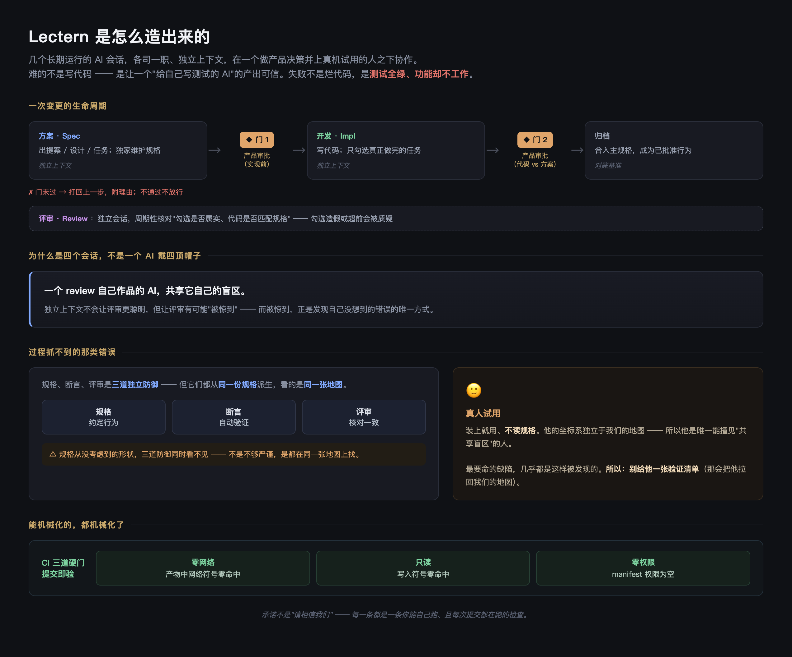

*[English](HOW_THIS_WAS_BUILT.md) · 中文*

# 这个项目是怎么做出来的

Lectern 由 AI 写成。代码、规格、验收测试，以及这份文档本身，几乎全部由 Claude 在
若干个长期运行、分工不同的会话里产出；一个人做产品决定，并在真实设备上试用结果。

这不是有意思的地方 —— 现在有大量软件是这么写出来的。**有意思的是要让产出可信需要
付出什么**，因为"AI 自己写代码又自己写测试"的失败方式不是代码写错，而是
**验收通过了、而功能并不工作**。

这份文档记录的就是这件事，**包括做错的部分**。它不是一套要卖给谁的方法论，它是一份
日志。

<!-- 这张图是下文机制的摘要，它是那些说法的第二份副本，且没有任何脚本能校验它 ——
     审批门、职能分工或 CI 检查一旦变了，要么重新生成，要么删掉。 -->

## 结构

四个职能，各自是一个独立上下文的会话：

- **产品** —— 定位、这东西是干嘛的，以及两道审批门：开工前一道，变更完成归档前一道。
- **规格** —— 拥有规格工件与每个变更的范围。实现方不改规格；代码与规格打架时，
  冲突要被抬上来，而不是就地悄悄消化掉。
- **实现** —— 写代码，并且**只勾选真正做完的任务**。
- **评审** —— 周期性核对勾选是否属实、代码与规格是否一致。

规格在 [`openspec/`](openspec/)：`specs/` 是已批准的行为，`changes/` 是在飞的提案
（含 design、delta spec、任务清单）。这个仓库里的一切都是这么建起来的，**归档的
变更还在里面，可以翻**。它们**原样保留**了当时写下的样子，包括当时内部使用的措辞 ——
事后去修一份记录，就把它变成了伪造的记录，而留着它们的意义恰恰在于它们是真的。

之所以拆成不同会话而不是一个 AI 戴四顶帽子，理由很窄也很实际：**自己评审自己的
工作，会共享自己的盲区。** 独立上下文并不会让评审方更聪明，但它让"评审方被出乎意料"
成为可能。

## 出过的错

**断言比 requirement 窄。** 一条 Scenario 写的是"显示标题大纲，**并可点击定位**"。
断言只覆盖了前半句，然后就绿了。Markdown 富文本视图下点击大纲毫无反应，持续了数周，
**而这期间全套自动化检查一直是绿的**。它的一般形式是：断言天然擅长证明"某个东西
存在"，很少证明**句子的后半截**也成立。由此长出来的习惯是：**把 requirement 的每个
分句拆开，逐句问"哪条断言证明了这一句"。**

**指标测对了，但问题的形状不是它能测的。** 图标配色用"两两色相差"来把关。数字说暗色
不比浅色差，眼睛说明显更差。指标没算错 —— 问题根本不在**任何一对之间**：有一个颜色
脚踩两组、把两组焊在了一起，而**两两比对的指标永远量不出一个不属于任何一对的成员**。
结论：**当数字与一个有依据的观察冲突时，第一个要排除的假设是"指标的形状不匹配问题的
形状"** —— 因为看错了可以再放大看一次来证伪，而**形状不对的指标会一直绿**。

**两条 requirement 各自都对，合起来漏一块。** 一条管跨文件导航，一条管单文件模式，
接缝处静默跳到了第一个候选，而不是给出列表。**没有任何东西报错。** 修法是结构性的
而不是靠更仔细：**凡是"换个模式仍然应该成立"的规则，写成不变量**；代码层不允许第二
条决策路径 —— 模式可以决定候选集合怎么来，**不能决定用户还有没有得选**。

**同一个错误换了三次马甲。** 两个不同语义共用一个机制，而且**每次都发生在更抽象的
地方**：

- **一条过滤规则。** Java 符号抽取按语法节点的**祖先集合**收定义。字段与局部变量的
  祖先集合完全相同 —— 它们只差直接父节点 —— 于是规则把每一个局部变量都悄悄收了
  进来。一个机制，被要求表达一个它根本表达不了的区分。
- **一个计数器。** 同一个"代次"数字既用来让符号索引失效，又用来取消在途搜索。这不是
  同一类事件：每次新搜索都 `++` 会把索引直接打掉。后来拆成了"失效用代次、取消用每次
  扫描自己的 runId"。
- **一条分类轴。** 规格曾把语言支持写成"三档"，把"**能不能从它跳转**"（代码理解属性）
  和"**高亮是否精确**"（高亮属性）混进了同一条枚举。Markdown（专用高亮 + 仅大纲）在
  两条轴上落在不同格子里，枚举当场崩掉。

第一次是**拿真实头文件跑抽取**时被抓到的；第二次是**评审设计**时被抓到的；第三次
一直活到变更归档、delta 合并进主规格、再拿它去和一份**独立写成的**覆盖清单对账才
暴露。**越往抽象层走，"跑一遍"越不管用，越要靠两份独立产物互相打架。**

## 流程抓不到的那一类

规格、断言、评审清单是三道独立的防御，但它们**共享同一个坐标系**：三者都从规格推导
而来。**规格从未设想过的形状，三道防御同时看不见** —— 不是因为不够严谨，而是因为
它们在同一张地图上找。

真正要命的缺陷，几乎每一个都是**一个人装上扩展、什么文档都不读、直接用**发现的。
由此得到本项目遵守的一条规则：**不要给那个人发验证清单。** 清单会把他拉进我们的地图，
于是他继承我们的盲区。装上，说一句"随便用"，然后等着。（**核验一条已知命题是相反的
任务，那种场合恰恰需要清单** —— 这两件事很容易被混为一谈。）

## 有哪些沉淀进了这个仓库

能机械化的教训，都被机械化了：

- 零网络与只读两条承诺，由 [CI](.github/workflows/ci.yml) 里的符号门禁强制，不靠
  任何人记得 —— 包括挡住一次由**构建工具自己注入**的网络调用；
- 语言覆盖文档与实现**一一对应**，两者不一致算文档的缺陷；
- 对用户的表述**说边界不说欠条**，且任何"不覆盖"的清单都明确标注是举例而非穷举 ——
  否则一份有限的排除清单，会被读成关于清单之外一切的承诺。

剩下那些仍然依赖"有人当时清醒"的部分，写在 [`CONTRIBUTING.zh-CN.md`](CONTRIBUTING.zh-CN.md)
里当作不变量 —— 这是我们找到的、最耐久的形式。
