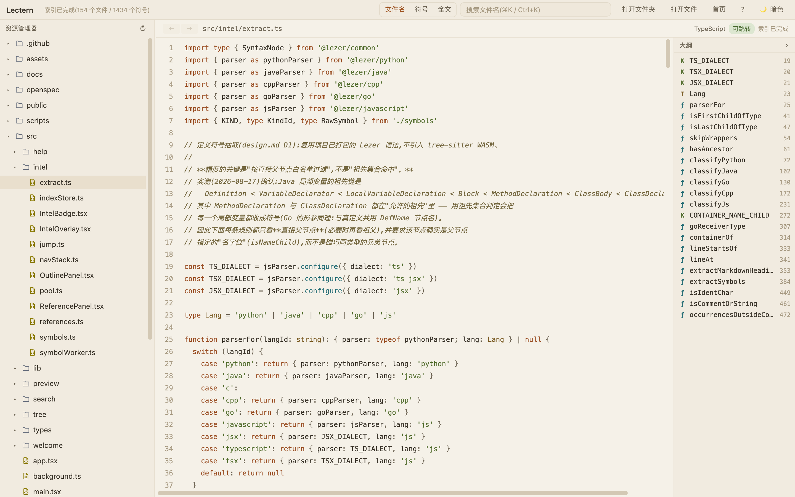
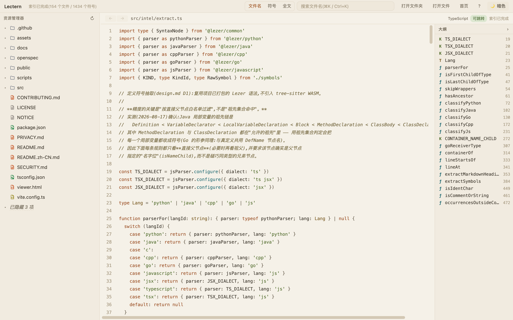
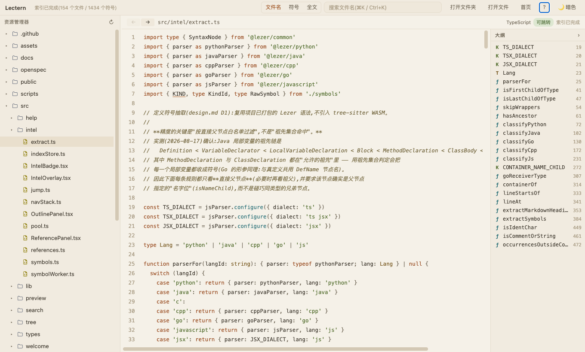
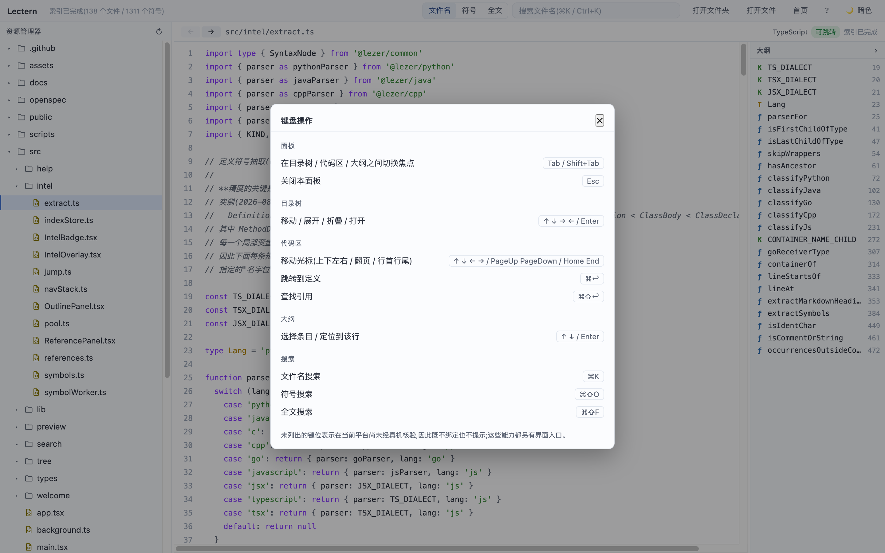

*English · [中文](README.zh-CN.md)*

# Lectern

[](https://github.com/zhurudong/lectern/actions/workflows/ci.yml)

**Read an unfamiliar codebase in a browser tab — offline, read-only, and
checkable in one command.**

More and more of the code you have to read is code you did not write: a
dependency you are about to trust, a repository you have been asked to audit,
a pull request an agent produced overnight. Lectern opens a folder from your
machine and gives you the part of an IDE that *reading* actually needs — file
tree, syntax highlighting, outline, go to definition, find references,
project-wide search — without installing an IDE, without uploading anything,
and without contacting remote servers.



<sub>Lectern reading its own repository. There is a dark theme too — [same screen](docs/images/hero-dark.png).</sub>

## Why

The usual answers to "I need to read this code" are *install something* or
*upload it somewhere*. Both are unavailable often enough to matter: a
locked-down work laptop, a customer's machine, an audit where the source may
not leave the room, a review of a repository you do not own and do not want to
paste anywhere. Lectern is neither — it is a browser extension that reads a
directory you explicitly hand it, or a local file URL after you enable Chrome's
file URL access setting.

Two properties define it, and they only work as a pair:

- **No remote traffic.** No telemetry, no update checks, no remote fonts, no
  CDN, no analytics. Everything is bundled. Local file opening uses only
  `file:///*` host access; no HTTP(S) hosts are permitted.
- **Read-only.** It never writes to the directory you open — not a lock file,
  not an index cache, not a marker. All state lives in browser storage inside
  your own Chrome profile.

These claims need an inspectable boundary. The local URL reader is audited
separately, and CI checks its exact content, the extension's permissions and
CSP, and forbidden transfer and write APIs in the rest of the package. The
checks below are part of the README so you can examine that boundary yourself.

### When Lectern is the wrong tool

- **You want to change the code.** Lectern cannot write, by construction. Use
  an editor.
- **You need compiler-grade accuracy.** Go-to-definition here is heuristic —
  syntax trees and name matching, no type inference, no import resolution. For
  exact answers, use a language server.
- **You are not on Chrome 122+.** Firefox and Safari differ in File System
  Access support and are not supported.

If your problem is *understanding* code that is already on your disk, and the
constraint is that nothing may leave the machine, that is the case this is
built for.

## What it does

**Open** a directory or a single file through the File System Access API, or
drag one directory or file anywhere onto the viewer page.
Recent projects are remembered (handles in IndexedDB) and reconnect after a
browser restart.

**Open local files automatically** in the same tab when a `file://` URL has a
selected extension, such as `.md`, `.sql` or `.java`. The *自动打开* settings
control the switch and extension list; Chrome's file URL access setting must
be enabled once. This opens a single file, without access to its parent folder.

**Navigate** a tree that loads lazily and scrolls virtually — comfortable at
around 10,000 files — with directories first and natural-order names. The heavy
directories that are not the code you came to read — `.git`, `node_modules`,
`target`, `.venv`, `__pycache__`, `dist`, `build`, `.next`, `.cache` — are
collapsed rather than swallowed: each level shows an *N hidden* row you can
expand and browse like any other.



Files inside them still preview and still get
an outline; they stay out of project-wide search and definition lookup, and the
preview says so when you open one, so the limit is never something you infer
from a search that came back empty.

The tree is navigable entirely from the keyboard, following the WAI-ARIA tree
conventions: arrows to move, right and left to expand and collapse or step in
and out, `Enter` to open, `Home`/`End` for the ends. The row your cursor is on
stays visually distinct from the file you are previewing, because they are not
always the same row.

**Read** through a read-only CodeMirror 6 view with line numbers and syntax
highlighting, light and dark themes, a draggable splitter, and a collapsible
outline. Markdown renders as rich text (GFM tables, fenced code highlighted by
declared language) with a toggle back to source; relative images resolve
through the directory handle, in-project relative links open in the viewer,
HTML is sanitized with DOMPurify, and remote images are never loaded.

**Compare local Git snapshots** from the project-only *变更* view. The base or
target can be a local branch, a remote-tracking branch, a tag, or a full or
uniquely abbreviated commit SHA; the current worktree is available as the
target. Remote-tracking branches are exactly the refs already stored in
`.git`—the UI labels them *本地快照* (local snapshot), and Lectern never fetches.
*审查改动* compares the merge base with the target; *直接比较* compares the two
selected endpoints directly. Changed files are grouped as added, modified, or
deleted and open in a read-only unified diff with a factual metadata panel.

**Understand**, offline, with no language server and no index on disk:

- **Outline** of the current file — types, functions, methods, fields,
  constants — click to jump to the line.
- **Go to definition** with `⌘/Ctrl`+click or the context menu, across files.
  When several definitions share a name you get the list; the tool does not
  guess for you.
- **Find references**, grouped by file, with matches inside comments and string
  literals excluded via the syntax tree rather than a regex.
- **Symbol search** across the project, and **full-text search** that streams
  results in, groups them by file, and can be stopped at any time.
- **Navigation stack** — step back and forward through the jumps you made.
- **Capability badge** in the preview header telling you what the current file
  supports, so you never have to infer it from a click that did nothing.

Code intelligence is **heuristic**: syntax-tree extraction plus name matching.
There is no type inference, no scope analysis, no import resolution, no macro
expansion, and no promise of compiler-grade accuracy.

## Language coverage

Lectern covers **28 language/syntax categories**: 26 with dedicated highlighting
and 2 with approximate highlighting. JSX counts with JavaScript, and TSX with
TypeScript.

| Tier | Categories | Languages |
| --- | --- | --- |
| **Navigable** (highlight + outline + definitions + references + symbol search) | 7 | Python, Java, C, C++, Go, JavaScript (incl. JSX), TypeScript (incl. TSX) |
| **Outline only** | 2 | Markdown (heading hierarchy), SQL (common object definitions and top-level queries/data operations) |
| **Highlight only** | 17 | JSON, YAML, TOML, XML, HTML, CSS, SCSS, Sass, Less, Shell, Rust, Ruby, Kotlin, C#, Groovy, Dockerfile, CMake |
| **Approximate highlight** (marked as such in the UI) | 2 | Vue, Svelte |

**File outlines cover 9 categories and 23 file extensions**: the 7 navigable
languages above (20 extensions), plus Markdown (`.md`, `.markdown`) and SQL
(`.sql`). Code outlines list symbols such as types, functions and methods;
Markdown outlines list headings. Click an entry to jump to its line.

**Rust (`.rs`) supports preview and dedicated syntax highlighting.** It does
not provide outlines, go to definition, find references or project-wide symbol
search.

By file extension, the preview registry contains **72 distinct extensions**:
45 code, 2 Markdown, 6 image (`.png`, `.jpg`, `.jpeg`, `.gif`, `.svg`, `.webp`)
and 19 plain-text extensions. Whole-name matches such as `Dockerfile`,
`CMakeLists.txt` and `Makefile` are handled separately and do not add to that
count. Binary-file placeholders are not counted as previews.

SQL outlines use heuristics to identify common statements, including table,
view and stored procedure definitions and top-level `SELECT` / `INSERT`
statements. Click an entry to locate it in the current file. SQL does not
participate in definition lookup, references or project-wide symbol search;
the outline does not provide complete SQL dialect parsing.

Other source-code and configuration types, including Makefiles, are shown as
plain text with line numbers. Common types that are **not** covered today include Swift,
Dart, Lua, Scala, R, Perl, PowerShell, Protobuf, PHP, GraphQL and Terraform/HCL;
**that list is illustrative, not exhaustive — absence from it does not mean a
type is covered.** The tiers above define language support. Full detail, per file extension, is in
[`docs/language-support.md`](docs/language-support.md).

## Install

Requires **Chrome 122+**.

**Recommended:** [install Lectern from the Chrome Web Store](https://chromewebstore.google.com/detail/lectern/ahmcjpgaejjfgiihipkjlhmepcnkbddm).
Chrome installs updates through the store, with no Developer mode required.

For an auditable manual install, or to pin a specific GitHub release:

1. Download `lectern-<version>.zip` from [releases](../../releases).
2. Unzip it, and **put the resulting `lectern` folder somewhere permanent**.
   Chrome loads the extension from that folder every time it starts — moving or
   deleting the folder uninstalls the extension.
3. Open `chrome://extensions`.
4. Turn on **Developer mode** (switch in the top-right corner).
5. Click **Load unpacked** (top-left) and select the `lectern` folder from
   step 2.
6. Click the puzzle-piece icon in the toolbar, pin Lectern, then click its icon
   to open the viewer.

Three things can surprise people when using the manual-install path:

- **Chrome warns about "extensions in developer mode" every time it starts.**
  That is what a manually loaded extension looks like; dismissing it is safe.
- **Reopening a recent project may ask for permission again.** Choose *Allow on
  every visit* in that prompt and Chrome stops asking.
- **Some directories cannot be picked at all** (system folders, the root of
  Downloads). Chrome refuses to hand them to any extension; pick a
  subdirectory.

**Or build it yourself**, if you would rather not run a binary you did not
produce:

```bash
npm ci
npm run build     # produces dist/ — load that folder in step 5 instead
```

Each GitHub release publishes two plain, CI-produced archives from the same
tagged build:

- `lectern-<version>.zip` wraps the extension in a `lectern/` directory for a
  convenient manual install;
- `lectern-<version>-web-store.zip` has `manifest.json` at its root and is the
  **exact file uploaded to the Chrome Web Store**.

Both archives have a SHA-256 file beside them. The store signs and repackages
the upload into a CRX, adding store metadata, so the downloaded CRX is not
byte-identical to the upload; its extension payload must still match the
tagged build.

## Using it

The interface is in Chinese; the labels below are given as you will see them.

1. **Open a folder** — click *打开文件夹* on the welcome screen and pick a
   project directory. (*打开文件* opens a single file.) Recent projects appear
   on that screen and reconnect with one click.
2. **Read** — click a file in the tree. The outline of the current file is on
   the right (*大纲*); clicking an entry jumps to that line.
3. **Compare Git snapshots** — switch from *文件* to *变更*. Choose the base,
   target and *审查改动* / *直接比较* mode. The anchored picker groups the current
   worktree, local branches, remote-tracking local snapshots, tags and Commit
   SHA input. `⌥↑` / `⌥↓` move between diff hunks.
4. **Jump to a definition** — **hold `⌘` (macOS) or `Ctrl`** and the
   identifiers you can jump to become underlined; click one to go there. Right
   click gives the same thing as a menu, plus **find references** (*查找引用*),
   grouped by file.

   

   <sub>A two-file sample, so the underline is easy to see. You never have to
   guess whether a symbol is resolvable: hold the key and the ones that are
   will say so.</sub>
5. **Come back** — the arrows at the top-left of the preview walk back and
   forward through the jumps you made.
6. **Search three ways** — the box at the top switches between *文件名*
   (filename, `⌘K` / `Ctrl+K`), *符号* (symbols across the project) and *全文*
   (full text, streamed in as it scans). They do not interfere with each other.
7. **Use the keyboard** — `Tab` / `Shift+Tab` move focus between the tree, the
   code and the outline. In the tree, arrows move, `→`/`←` expand and collapse
   and `Enter` opens the file. In the code, arrows move the cursor, **`⌘↩`
   jumps to the definition** and **`⌘⇧↩` finds references**; `⌥←` walks back.
   In the outline, arrows and `Enter` locate a symbol.

   The **`?`** button in the toolbar lists every binding, and closes with
   `Esc` — which the panel itself tells you, on its own second row:

   

   <sub>The labels in that panel and the bindings themselves are read from one
   source, so a changed binding cannot leave a stale label behind — there is a
   test that mutates the binding and fails if both do not move together. The
   last line of the panel is the boundary: combinations that are not listed are
   not bound on this platform, because they were not verified on real hardware
   there.</sub>
8. **Refresh after editing elsewhere** — the ↻ button above the tree re-reads
   the directory; clicking a file always re-reads it from disk. Nothing is
   watched automatically, because the API provides no change events. For an
   automatically opened local file, refresh the browser tab to read it again.

On macOS there are two extra shortcuts, verified on real hardware: `⌘⇧O` for
symbol search and `⌘⇧F` for full-text search. They are deliberately not bound
on Windows and Linux — see [Boundaries](#boundaries).

### Automatically open local files

1. Open *自动打开* in the viewer's top toolbar. Follow its extension-details
   link, then enable **Allow access to file URLs** in Chrome. You can also find
   it at `chrome://extensions` → Lectern → **Details**. Opening files or folders
   through the normal picker does not require this setting.
2. Choose the extensions to handle and save. The switch starts enabled, with
   code, Markdown and plain-text extensions selected. HTML and images start
   unselected. You can select all, clear the list, restore defaults, or disable
   automatic opening entirely; saved changes apply to subsequent navigation.
3. Open a matching local file in Chrome. Lectern replaces that file view in the
   same tab. Refresh the tab after an external edit to read the file again.

Matching ignores case and supports encoded names, spaces and non-ASCII names.
The candidates come from the preview format list, excluding unsupported
binaries. This handles suffixes only: extensionless names such as `Dockerfile`
still work through the picker but are not automatic-opening rules. HTTP(S)
links, directories, embedded frames and page resources are not handled, and
the feature does not change the operating system's default application.

If access is missing or revoked, a file is gone, or a read fails, the viewer
provides an explanation and recovery actions. Automatic URL reads are limited
to **64 MiB**; choose a larger file through *打开文件* instead. The usual preview
limit still applies: text above **5 MiB** displays only its first **1 MiB**.

Single-file mode supports its existing outline and applicable jumps within
the file. Cross-file navigation, references, project search and Markdown
relative images or links require opening the containing folder; automatic
opening does not grant a directory handle.

## Checking the two promises yourself

```bash
npm ci && npm run build
node scripts/check-invariants.mjs
```

Read the script before trusting it. It checks the built package against exact
permission and CSP allowlists, rejects filesystem write APIs everywhere, and
rejects transfer APIs outside the one audited `local-file-reader.js` module.
That module is checked against a fixed digest; changes to its contents require
review and a corresponding audit update. Negative checks cover HTTP(S), remote
file hosts and malformed input. The script owns the forbidden-symbol list.

The standard build declares only `storage` and
`declarativeNetRequestWithHostAccess`, with `file:///*` as its only host
permission. Only `viewer.html` is exposed as a web-accessible resource, and
only to `file:///*`. Its CSP is `script-src 'self'; object-src 'self';
connect-src 'self' file:`. Native picker reads use `handle.getFile()`; the URL
reader validates local addresses, rejects redirects and limits the read size.
Rendered file content must not become an arbitrary local-file reading entry.

The same script runs on every push and pull request in
[CI](.github/workflows/ci.yml), so a change that breaks either invariant fails
the build. In the browser you can also keep DevTools → Network open on the
viewer page: extension resources and local `file://` reads are expected;
outbound HTTP(S) requests are not.

## Boundaries

These are boundaries, not IOUs — the tool is not going to grow into these.

- **UTF-8 only.** GBK, Latin-1 and other encodings render as garbage; there is
  no encoding detection.
- **No file watching.** The File System Access API provides no change events.
  Refresh the tree, or click the file again, to re-read from disk. Refresh the
  browser tab for an automatically opened local file.
- **Read-only.** No editing, no saving.
- **Git comparison is local and read-only.** No fetch, pull, checkout, index,
  staging, commit, merge, or Git write occurs. Remote-tracking refs are local
  snapshots, not live remote state.
- **Git repository shapes are deliberately bounded.** SHA-1, non-bare
  repositories whose `.git` object database stays inside the authorized root
  are supported. Bare repositories, SHA-256 object format, and authorization-
  external `gitdir` / alternates report an explicit unsupported reason. The
  browser cannot observe worktree executable bits or symlinks exactly, and the
  UI says so instead of claiming a complete comparison.
- **Protected directories cannot be picked.** Chrome refuses to grant some
  directories (system directories, the root of Downloads); choose a subdirectory.
- **The index is in memory only.** It is rebuilt when a project is reopened
  (seconds at ~10,000 files). Files above 5 MiB are excluded from symbol
  extraction, and the index is capped at 400,000 symbols — when the cap is hit
  the UI says so rather than pretending to be complete.
- **Large files are truncated.** Text above 5 MiB displays its first 1 MiB and
  says it did. Automatic URL reads stop at 64 MiB; larger files can be opened
  through the picker with the same text-preview limit.
- **Chrome only.** Firefox and Safari differ in File System Access support.
- **Keyboard shortcuts on Windows and Linux are deliberately not bound.** The
  candidate combinations collide with browser-level shortcuts there and could
  not be verified on real hardware, so nothing is bound and nothing is hinted
  in the UI — every capability is reachable through the interface itself. The
  extra macOS shortcuts that *are* bound were verified on real hardware.
- **The interface is in Chinese.** Documentation is in English; UI strings are
  not translated today.

## Documentation

- [`docs/language-support.md`](docs/language-support.md) — coverage per file
  extension, and what each tier means.
- [`openspec/`](openspec/) — the specifications this is built against.
  `openspec/specs/` is current approved behavior; `openspec/changes/` holds
  in-flight proposals. `openspec/changes/archive/` is left exactly as it was
  written during development, internal working vocabulary included — editing a
  record after the fact would make it a fabricated one.
- [`CONTRIBUTING.md`](CONTRIBUTING.md) — the three invariants a change must not
  break, and how changes are made here.
- [`SECURITY.md`](SECURITY.md) — what counts as a vulnerability, and how to
  report one.
- [`RELEASING.md`](RELEASING.md) — how release artifacts are produced, and why
  they are never built by hand.
- [`PRIVACY.md`](PRIVACY.md) — the privacy policy, which is short because
  there is nothing to disclose.
- [`HOW_THIS_WAS_BUILT.md`](HOW_THIS_WAS_BUILT.md) — this project was written
  by AI agents working to a spec-driven process; this is the account of how,
  including what went wrong.

## License

[Apache License 2.0](LICENSE). Bundled third-party components keep their own
licenses — see [`THIRD-PARTY-NOTICES.md`](THIRD-PARTY-NOTICES.md).
